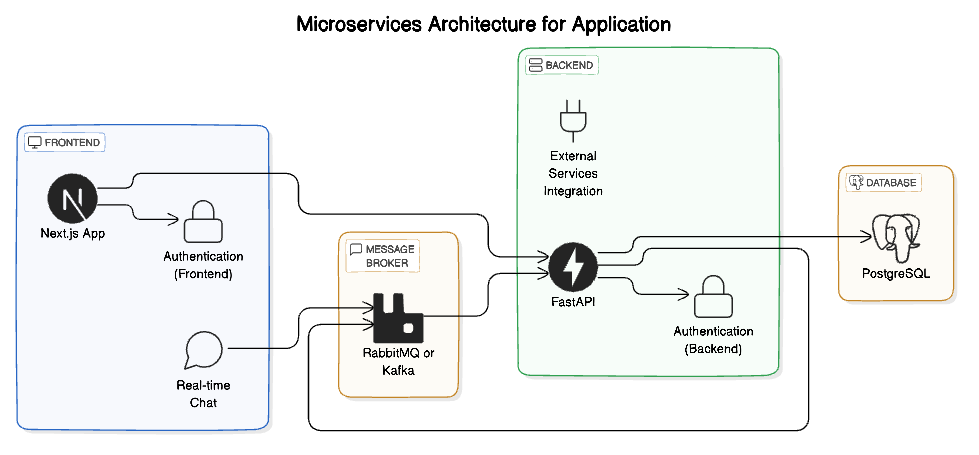

# End-to-End Chatbot Application

Welcome to the **End-to-End Chatbot Application**! This project is a comprehensive chatbot system that integrates a modern frontend built with [Next.js](https://nextjs.org/) and a robust backend using [FastAPI](https://fastapi.tiangolo.com/). Designed with scalability, maintainability, and performance in mind, this application leverages a microservices architecture and serverless environments to deliver an efficient conversational AI experience.

## Table of Contents

- [Features](#features)
- [Technologies Used](#technologies-used)
- [Architecture](#architecture)
- [Getting Started](#getting-started)
  - [Prerequisites](#prerequisites)
  - [Installation](#installation)
  - [Running the Application](#running-the-application)
- [Project Structure](#project-structure)
- [API Documentation](#api-documentation)
- [Frontend](#frontend)
  - [UI Components](#ui-components)
  - [Styling](#styling)
- [Backend](#backend)
  - [Services](#services)
  - [Database](#database)
- [Testing](#testing)
- [Deployment](#deployment)
- [Contributing](#contributing)
- [License](#license)

## Features

- **User Authentication:** Secure user login and signup functionalities.
- **Real-Time Chat:** Interactive chatbot interface with real-time messaging.
- **Agent Configuration:** Multiple agent types and models for diverse conversational behaviors.
- **Responsive Design:** Fully responsive UI built with [Shadcn UI](https://ui.shadcn.com/), [Radix UI](https://www.radix-ui.com/), and [Tailwind CSS](https://tailwindcss.com/).
- **Microservices Architecture:** Scalable backend with FastAPI and serverless optimizations.
- **Asynchronous Processing:** Efficient background task handling using asynchronous workers.
- **Comprehensive Logging & Monitoring:** Enhanced observability with Prometheus, Grafana, and structured logging.

## Technologies Used

- **Frontend:**
  - [Next.js](https://nextjs.org/) with App Router
  - [React](https://reactjs.org/)
  - [Shadcn UI](https://ui.shadcn.com/)

- **Backend:**
  - [FastAPI](https://fastapi.tiangolo.com/)

- **Other Tools:**
  - [Docker](https://www.docker.com/) for containerization
  - [Gradio](https://gradio.app/) for frontend interfaces

## Architecture

The application follows a **microservices architecture** consisting of separate frontend and backend services:

- **Frontend (`ui`):** Built with Next.js, it handles the user interface, authentication, and real-time chat interactions.
- **Backend (`backend`):** Powered by FastAPI, it manages API endpoints, business logic, authentication, and integrates with external services.
- **Database:** PostgreSQL is used for persistent data storage, managed through SQLAlchemy ORM.
- **Message Broker:** Implements event-driven architecture using message brokers like RabbitMQ or Kafka for resilient service communication.



## Getting Started

### Prerequisites

Before you begin, ensure you have met the following requirements:

- **Node.js** (v14 or later)
- **Python** (v3.11 or later)
- **Docker** (for containerized services)
- **Poetry** (for Python dependency management)

### Installation

1. **Clone the Repository:**

   ```bash
   git clone https://github.com/bmd1905/e2e-chatbot.git
   cd e2e-chatbot
   ```

2. **Setup Backend:**

   ```bash
   poetry install
   ```

   - **Configure Environment Variables:**

     Create a `.env` file based on the provided `.env.example` and set your configuration variables.

3. **Setup Frontend:**

   ```bash
   cd ../ui
   npm install
   ```

### Running the Application

1. **Start the Database:**

   Ensure Docker is running, then start PostgreSQL:

   ```bash
   make db
   ```

2. **Run Backend with FastAPI:**

   ```bash
   poetry run uvicorn backend.main:app --reload
   ```

3. **Run Frontend with Next.js:**

   ```bash
   npm run dev
   ```

4. **Access the Application:**

   Open [http://localhost:3000](http://localhost:3000) in your browser to interact with the chatbot.
